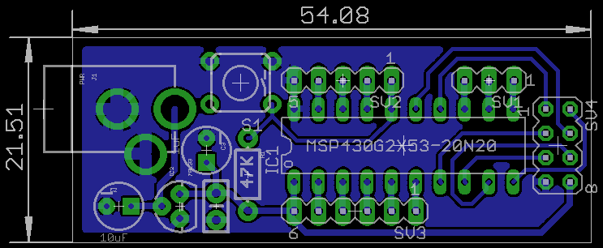

MSP430 nRF24L01
===============

This is just a minimalist MSP430G2553 board with nRF24L01 header. All components are through hole.

Note: You should consider changing the trace width on the header before etching if the clearance is too close.

